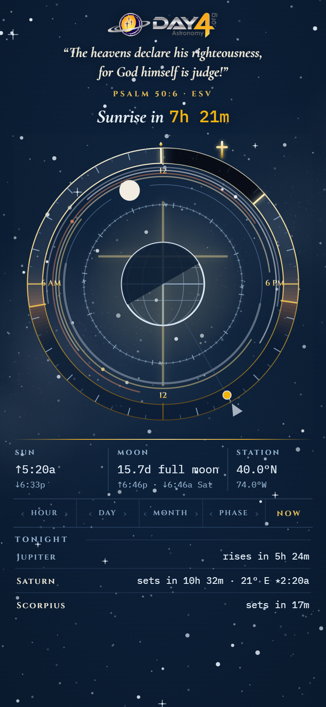
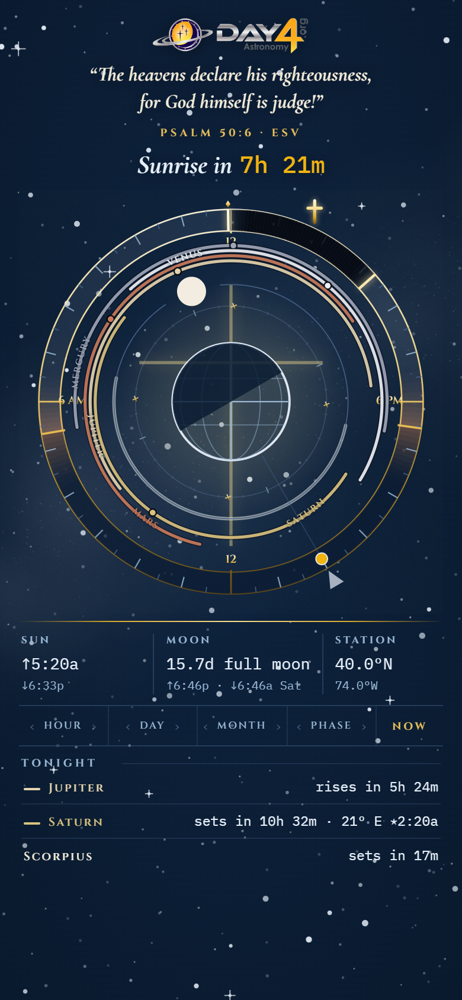
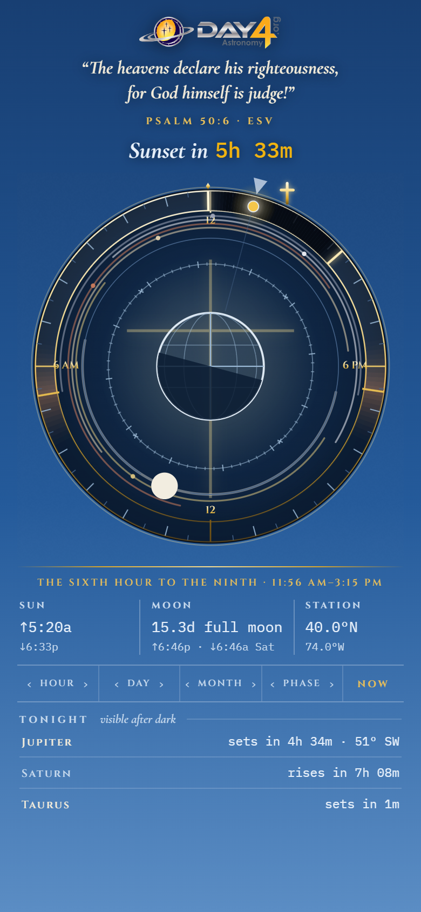
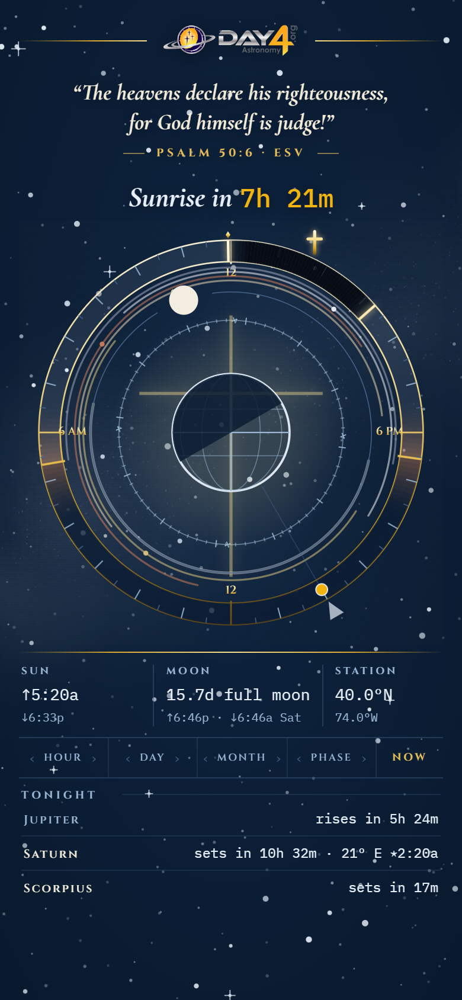
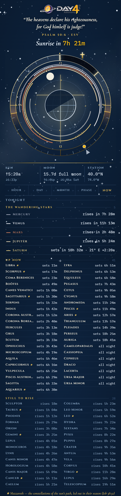

# Atelier — five design directions (2026-09-02)

Real renders at 390×844 from `web/atelier.html?d=<name>` on live engine data
(40°N 74°W, 28 Aug 2026, 10 pm; the Noon at 1 pm). Local review page only —
never built or deployed (DEC-028).

## 1. The Plinth — `d-plinth`
Everything below the dial becomes one carved base under a single gilded rule:
three bays (SUN ↑↓, MOON with its times, STATION), one stepper rail with NOW,
one TONIGHT ledger. Dial untouched. Fixes weak point 1 by subtraction.

## 2. The Choir — `d-choir`
The planet arcs made legible: 2.6px strokes on a dark keel, wider spacing,
peak dots, each name set along its own arc in its own colour. The moon steps
inward so the five arcs own a clear band. Fixes weak point 2.

## 3. The Noon — `d-noon`
By day the page is a zenith-to-horizon sky gradient, but the dial keeps its
own night: a dark lapis tondo with a bevelled rim so gold, ivory and arcs hold
their drama at high sun; the sun gets a corona. Fixes weak point 3.

## 4. The Frontispiece — `d-frontispiece`
The header on an 8px rhythm: the logo shrunk and set between gilded hairlines
as a maker's seal, verse to 19px, citation flanked by short gold rules, the
hero given air. Fixes weak point 4 without redrawing the brand mark.

## 5. The Oculus — `d-oculus`
Interior subtraction plus the program: hairline sidereal ring with gold
Giotto stars, moon construction orbit removed, and the expanded TONIGHT as
movements — The Wandering Stars, Up Now, Still to Rise, Mazzaroth starred.
Fixes weak points 5 and 6.

**Recommendation:** 1 + 4 + 5 as the base, the Choir's arc weight at the
Oculus's spacing, and the Noon tondo only above ~8° solar altitude.
