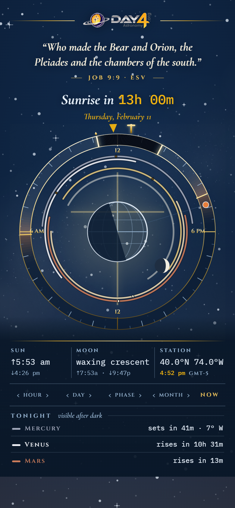
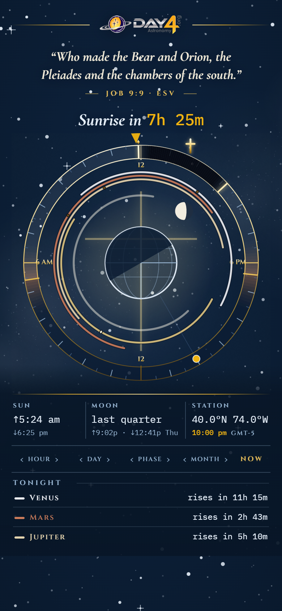
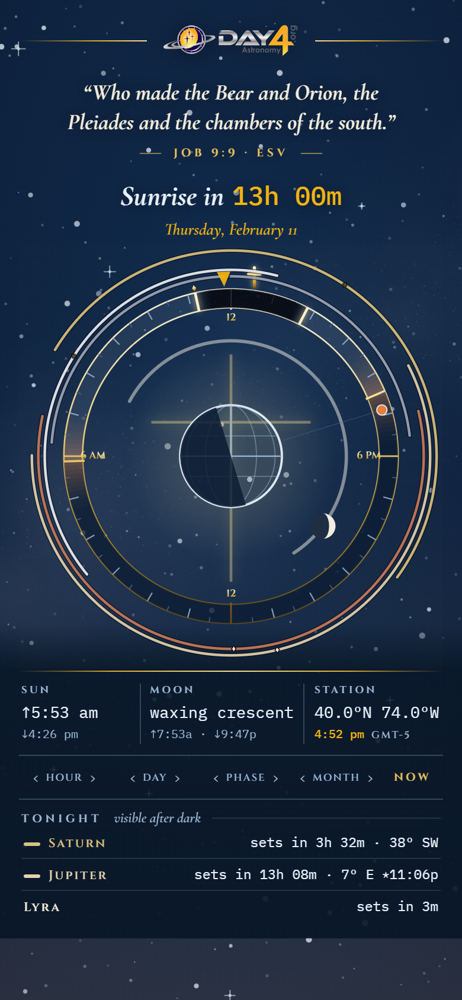
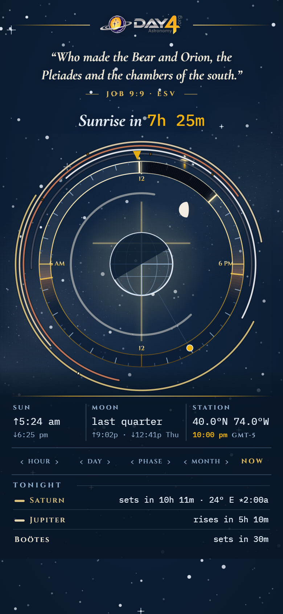
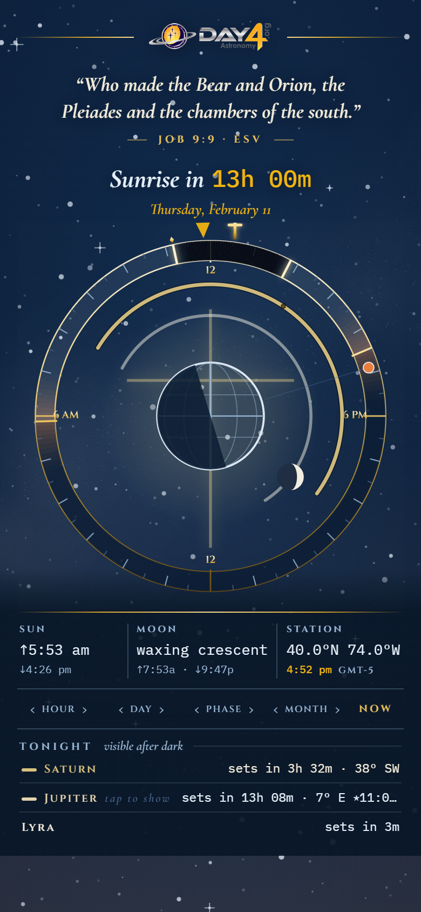
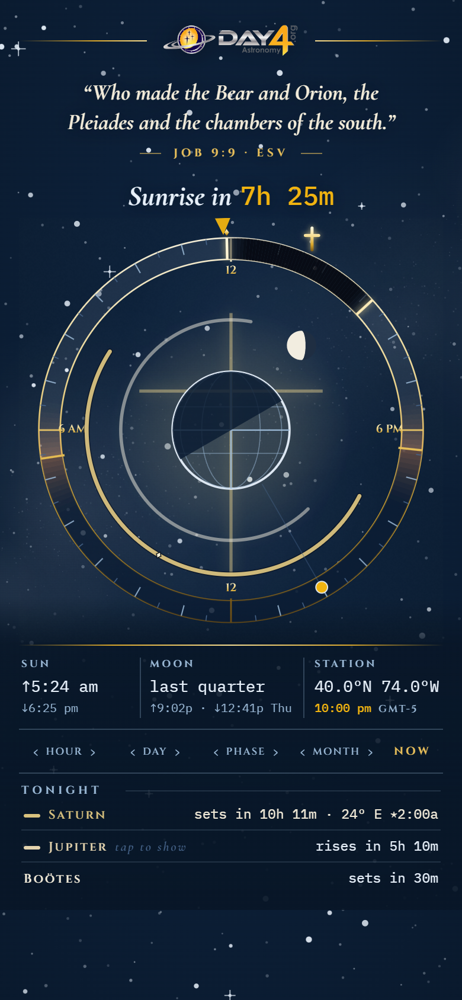

# Atelier II — uncrowding the dial (2026-09-02)

Owner's phone shot of the shipped DEC-035 page: "very crowded and I can't
see some of the text." Three reimaginings, each rendered twice — at the
owner's date (Thu 11 Feb 2027, 4:52 pm, `-feb`) and tonight (`-now`) —
from `web/atelier2.html?d=<name>&when=<feb|now>`. Local only, never built.

Common to all three: no text on the dial (the ledger's swatch + name is the
legend), the sidereal ring gone, the moon's construction orbit gone, and a
scrim under the plinth so stars never run behind type.

## 1. Tonight only — `d=tonight`
An arc is drawn only when the planet is above the horizon for at least an
hour of real night on the displayed date; day-only planets vanish.

 

## 2. The rete — `d=rete`
All five arcs move OUTSIDE the band as thin rings round the rim, the way the
original app carried them; day-only planets at a third the ink. The interior
holds only earth, axis, and moon.

 

## 3. One chosen star — `d=one`
A single full-weight arc for one object (Saturn by default); tapping a name
in TONIGHT would switch it — the original's tap-to-switch model.

 
