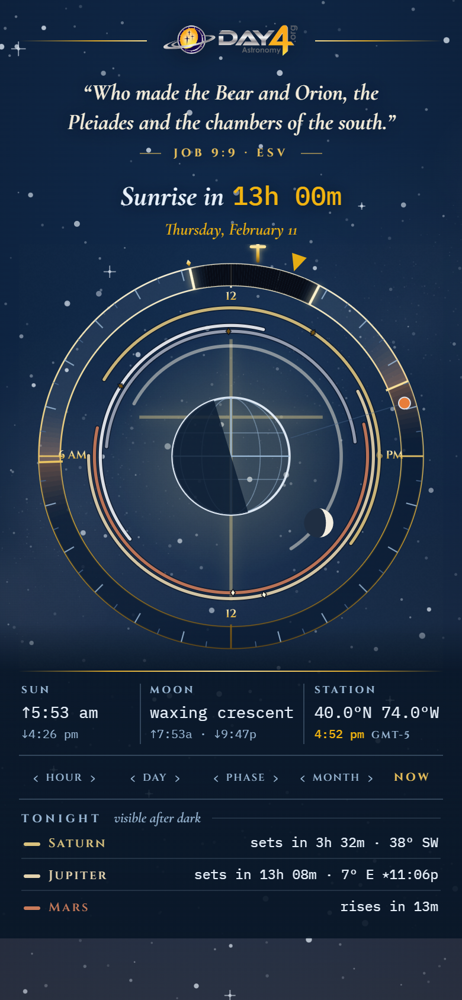
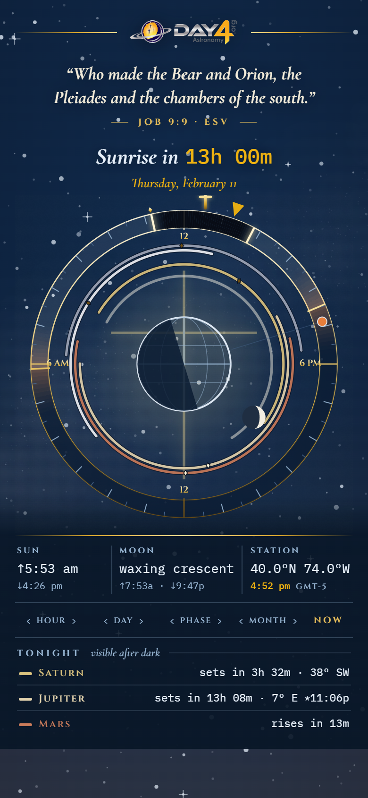
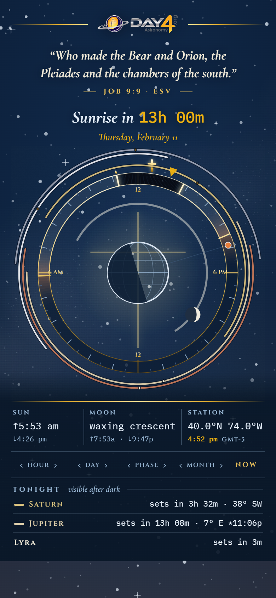
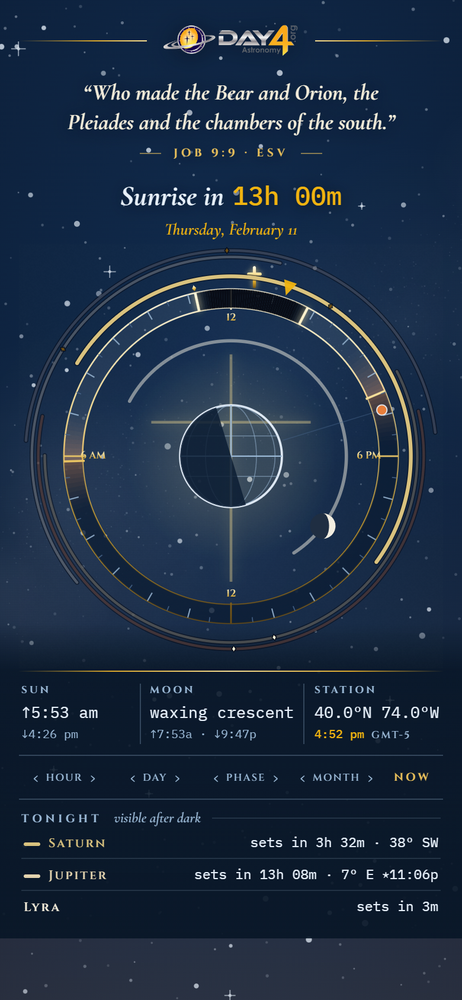

# Atelier III — the order of the rings (2026-09-02)

Four ways to stage the five planet rings against the band, all at the
owner's date (Thu 11 Feb 2027, 4:52 pm). `web/atelier2.html?d=…&order=…`.
Local only, never built.

## A. The spheres, inside — `d=all&order=spheres` (LIVE now)
Outward from the Earth at the centre: Moon, Mercury, Venus, Mars, Jupiter,
Saturn, then the Sun on the band. The classical astrolabe order.

## B. From the Sun, inside — `d=all&order=helio`
The band is the Sun; Mercury rides nearest it and Saturn nearest the Earth.
Reads as the solar system from the Sun inward.

## C. The rete, from the Sun — `d=rete&order=helio`
Rings outside the band: the band is the Sun, Mercury is the first ring out,
Saturn the last — the true heliocentric order, and the interior is empty.

## D. The rete, one ring lit — `d=rete&order=helio&lit=Saturn`
As C, but tapping a name in TONIGHT lights that ring and dims the rest.

